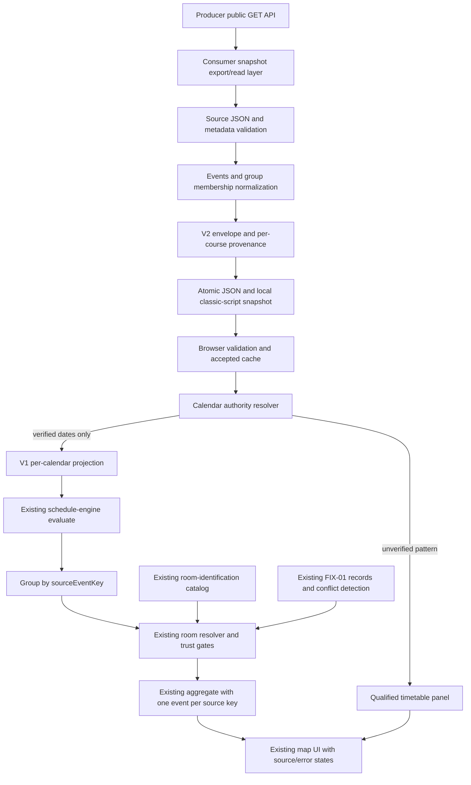

# MAP-02A — фактический API и предлагаемый consumer contract

Исследование 2026-10-09; consumer `e14273370cc419e5acd21b78cd2ea51a3d6d4127`, producer source `735b64f28e78eb1de98c36bb68ddf4dc3ecc0426`. Production Git SHA неизвестен. Обозначения E1–E9 разрешаются в [реестре отчёта](MAP-02A_REPORT.md#реестр-доказательств). **OBSERVED** — captured public GET; **SOURCE-DEFINED** — текущие исходники; **PROPOSED** — будущая политика/схема, не реализация и не принятое решение.

## 1. Public routes и query semantics

Base URL: `https://utm-curs-i-orar-2027.onrender.com`. Route handlers экспортируют GET; изменение данных через public read routes consumer-ом не предусмотрено. HEAD/OPTIONS/other methods framework-managed и здесь не live-tested. Не использовать admin routes. Public GET groups/schedule может дождаться собственной cold bootstrap producer, если кеш пуст; это SOURCE-DEFINED implicit producer behavior, отдельный refresh trigger consumer не вызывает. [E2: routes, schedule-service.ts:106–114]

| Route | Параметры | JSON success keys | Errors / evidence |
|---|---|---|---|
| `/api/health` | Course selector не читается | ok, status, has_schedule, courses, time | 200 OBSERVED; отдельного withErrorHandling wrapper нет |
| `/api/status` | Optional course | ok, has_schedule, course_year, course_label, supported_courses, schedule, source, server_time, timezone | 200 OBSERVED; 400 selector OBSERVED; schedule=null при unavailable SOURCE-DEFINED |
| `/api/source` | Optional course | course_year, official_page_url, pdf_url, pdf_hash, source_kind, pdf_title, academic_year, semester, downloaded_at, parsed_at, etag, last_modified, last_check_at, last_success_at, last_result, last_error, parity_note | 200 OBSERVED; поля могут быть null; source_transport/snapshot_id/parser_version сюда не экспортируются |
| `/api/groups` | Optional course | course_year, groups:[{name,program,lessons}], count, updated_at | 200 OBSERVED; 503 SOURCE-DEFINED |
| `/api/schedule` | Optional course, group, day, teacher, subject, room, q | course_year, metadata, groups:string[], days, time_slots, lessons, count, warnings | 200 OBSERVED; 400 bad nonempty day / 503 missing schedule SOURCE-DEFINED |
| `/api/schedule/{group}` | Required path group; optional course/day | group, course_year, metadata, time_slots, days, lessons, by_day, count | 200 OBSERVED; 404 unknown group OBSERVED; 400/503 SOURCE-DEFINED |
| `/api/schedule/{group}/today` | Required path group; optional course | group, course_year, day, is_weekend, lessons, count, updated_at | 200 OBSERVED; weekend day=null/list=[] SOURCE-DEFINED; weekday only, не parity/calendar date validity |

Полный payload и metadata нужны из `/api/schedule`; status нужен для runtime anchor/check diagnostics. Для initial consumer snapshot достаточно schedule+status на каждый запрошенный курс — **четыре GET для обоих курсов**, groups derive-ятся из full payload. `/api/source` полезен диагностически, но не заменяет полную metadata. `today` непригоден как источник произвольного selected date. Pagination/source API version отсутствуют. [E2, E3]

`course` отсутствует → configured default; runtime OBSERVED=1. Pure `resolveCourseSelection` поддерживает default 2 и ordered list `2,1`. Public selector должен быть ровно enabled "1" или "2"; empty, whitespace, "01", "1.0", unsupported, повторный ключ → 400. Disabled implemented course тоже rejected. `supported_courses` у 400 — массив чисел; у status — массив `{course_year,label,roman}`. Группа scoped внутри курса; не определять course по SI/TI/year digits. [E2: courses.ts, api.ts; E3; E7]

Group нормализуется trim+uppercase. Day filter поддерживает Romanian/English weekday aliases включая marti/marți/marţi; empty отсутствующий filter не ограничивает. Text filters case/accent insensitive substring, q ищет также raw_text. Collection unknown group даёт пустое совпадение, group path — 404. Для filter keys кроме course используется первый `params.get`; неизвестные query keys игнорируются исходниками. В adapter отправлять только allowlisted keys, explicit course, URL-encoded group. Эти edge cases SOURCE-DEFINED, не все live-probed. [E2: schedule-service.ts:29–85]

## 2. Exact producer LessonSchema

Следующий type полностью отражает LessonSchema на указанной source revision; все поля обязательны, nullable только явно обозначенные. [E2: models.ts:10–62]

```ts
type SourceLesson = {
  id: string;                           // min length 1; schema не требует 12 hex
  day: "Luni" | "Marți" | "Miercuri" | "Joi" | "Vineri";
  slot_index: number;                    // integer >= 0
  slot_span: number;                     // integer >= 1
  start_time: string; end_time: string;   // source regex /^\d{2}:\d{2}$/
  groups: string[];                      // nonempty array; each string length >= 1
  subject: string;                       // length >= 1
  teacher: string | null;
  room: string | null;
  lesson_type: "lecture" | "lab" | "seminar" | "practice"
    | "physical_education" | "language" | "project"
    | "individual_group_activity" | "unknown";
  subgroup: string | null;
  week_parity: "odd" | "even" | "both" | "unknown";
  notes: string[];
  raw_text: string;
  geometry: { page: number; x0: number; y0: number; x1: number; y1: number };
  // page integer >= 1; coordinates numbers; this is PDF geometry, not map geometry
  confidence: number;                   // 0..1
  uncertain: boolean;
};
```

Producer schema допускает repeated group entries, blank nullable strings и id произвольной формы; consumer validation должна быть строже без потери исходного значения. В изученных данных repeated IDs не обнаружены. LessonSchema не содержит buildingId, per-lesson academic year/validity/exceptions или sourceLessonId. Group membership multi-column cell сохраняется в одном исходном record. InterpretCell возвращает отдельные segment records, когда текст разделяется; общий `0.5 gr.` не является стабильной идентичностью конкретной половины. [E2: lesson-interpreter.ts:108–170, 210–267; E6, E7]

`slot_span` already embodied в start_time первого и end_time последнего row. Не создавать отдельную lesson на каждый slot и не пересчитывать end по длительности. Составные room strings сохраняются: parser может объединить второй room через `/`; это не указание group→room assignment. Null teacher/room может быть нормальным отсутствием printed information для languages/sport/individual activities; null не обозначает отмену занятия. [E2: lesson-interpreter.ts:159–170, 214–215, 249–267, 284–309]

## 3. Metadata и response objects

```ts
type SourceMetadata = {
  academic_year: string | null;
  semester: string | null;
  course_year: number;                  // source integer, consumer restricts to requested 1/2
  source_page_url: string;
  source_pdf_url: string;
  source_pdf_hash: string;              // source schema string, consumer requires SHA-256 hex
  source_kind: "live" | "wayback" | "seed" | "manual";
  source_transport: "direct" | "broker"; // Zod decoding default direct
  source_snapshot_id: string | null;    // decoding default null
  downloaded_at: string; parsed_at: string;
  parser_version: string;
  etag: string | null; last_modified: string | null;
  pdf_title: string | null;
};
type FullResponse = {
  course_year: number; metadata: SourceMetadata;
  groups: string[];
  days: SourceLesson["day"][];
  time_slots: {index:number; start_time:string; end_time:string; raw:string}[];
  lessons: SourceLesson[]; count: number; warnings: string[];
};
type StatusResponse = {
  ok: boolean; has_schedule: boolean; course_year: number; course_label: string;
  supported_courses: {course_year:number; label:string; roman:string}[];
  schedule: null | {
    academic_year:string|null; semester:string|null; course_year:number;
    source_kind:SourceMetadata["source_kind"]; source_pdf_url:string;
    source_pdf_hash:string; downloaded_at:string; parsed_at:string;
    parser_version:string; groups:number; lessons:number;
    uncertain_lessons:number; warnings:string[];
  };
  source: {
    page_url:string; current_pdf_url:string|null;
    etag:string|null; last_modified:string|null;
    last_check_at:string|null; last_success_at:string|null;
    last_result:"updated"|"unchanged"|"rejected"|"error"|"seeded"|"never";
    last_error:string|null; last_error_at:string|null; parity_note:string|null;
    odd_week_anchor:string; refresh_interval_minutes:number;
  };
  server_time:string; timezone:string;
};
```

SOURCE-DEFINED в `models.ts:81–110,202–219` и `schedule-service.ts:117–167`; формы OBSERVED обоими курсами. API wrapper не имеет schemaVersion. Source parser извлекает academic_year/course/semester из PDF title с fallback provenance; semester может происходить из discovery inference, а API не экспортирует отдельный semester authority flag. Для календарных dates metadata names недостаточны. [E2: parser/index.ts:94–155]

## 4. Source → MAP-01 field mapping

S = полностью поддержан структурно; P = частично; B = blocked authority/semantics. High confidence в преобразовании поля не означает high confidence физического факта. V1 Lesson optional поля не превращаются в достоверные defaults. Все строки опираются на E1 contract/engine и E2 models/routes; actual values — E3/E6.

| Target | Source / transformation | Validation | Safe default / missing behavior | Provenance / confidence / support |
|---|---|---|---|---|
| `id` | Membership tuple из revision-scoped sourceEventKey + group + subgroup | Unique tuple; reject conflicting duplicate source ID; bounded strings | Нет random/index ID; ambiguous duplicates quarantined | Source id + PDF hash/parser/course; high transform confidence; S внутри revision, P между revisions |
| `group` | Каждое distinct `groups[]` → одно membership | Nonblank; exists full groups list; course scoped | Нет fixture/default group; missing reject record | Original group membership; high; S |
| `subgroup` | `subgroup` string/null без переименования | Nonblank if present; preserve `0.5 gr.` | Null сохранять; anonymous half не присваивать «1/2» | Printed parser marker; high copying / unresolved personal targeting; P |
| `courseYear` | Explicit requested course + root course_year + metadata.course_year | Все три совпадают; integer enabled 1/2 | Нет inference из group; mismatch reject entire course candidate | Endpoint + metadata; high; S |
| `academicYear` | metadata.academic_year → context/lesson при наличии | Nonblank normalized year format, retain original text; match context | Null не заменять DEMO/year from system clock; date evaluation blocked | Metadata/PDF title, fallback origin не всегда экспортируется; P |
| `subject` | subject без повторной canonicalization | Nonblank; uncertain flag separate | Missing reject/quarantine; не получать из room/teacher | Source normalized subject + source id; high copying; S структурно |
| `teacher` | teacher string/null | Type/length; plain text escaping | Null сохранять как «не указан»; не выдумывать имя | Source interpreter; high copying, identity accuracy unverified; S |
| `source` | Constant `timetable` для validated real envelope | Не смешивать с mock; validate provenance independently | Нет demo fallback inside real mode | Producer lineage; high label confidence, label не evidence; S |
| `buildingId` | Только explicit full building notation или separately approved contextual authority | Contradictory prefix fails closed; bare digits недостаточно | Null/unknown-building; no default utm-b3 | Explicit source syntax / будущий authority record; P/B для bare values |
| `room` | Preserve raw room; actual FIX-01 parser canonical output отдельно | Single map-supported code; multiple/named/range notation quarantine mapping | Null missing-room; unfamiliar raw остаётся в panel; не брать floorGuess | Source string + room parser + room catalog authorities; P |
| `weekday` | Luni=1, Marți=2, Miercuri=3, Joi=4, Vineri=5 | Closed mapping; map ISO 1..7 | Unknown reject; не устанавливать weekday из selected date | Source day; high; S |
| `startTime` | start_time | Strict HH:mm, 00..23:00..59, start<end | Missing reject; не fixture slot | Source interval; high; S |
| `endTime` | end_time, already spans slot_span | Same validation; no overnight support | Missing reject; не start+90min | Source interval; high; S |
| `weekParity` | odd/even/both verbatim | Anchor authority для restricted date claims | unknown сохраняется в v2 unresolved; не both, не omission in evaluable lesson | PDF positional interpretation + runtime anchor; P |
| `weekNumbers` | Не предоставляется | Положительные official week numbers только с authority | Omit in pattern; authorityUnknown envelope; confident date result blocked where needed | Нет upstream authority; B |
| `validFrom` | Не предоставляется | Valid civil date; per-record/semester authority; within period | Не parsed_at/downloaded_at/anchor; omitted until verified | Нет source validity calendar; B |
| `validUntil` | Не предоставляется | Date>=validFrom; bound max two years для v1 | Не next refresh/end of year; omitted until verified | Нет authority; B |
| `specificDates` | Не предоставляется | Actual explicit exception dates with evidence | Unknown, не фиктивный пустой array как proof no special dates | Нет authority; B |
| `excludedDates` | Не предоставляется | Official teaching exclusions scoped by cohort | Unknown; не предполагать отсутствие праздников; evaluation gate | Нет authority; B |

Dataset-level context: `academicYear` available currently; timezone из status проверять ровно Europe/Chisinau; `startDate/endDate` blocked; `weekAnchorDate` available as **configured**, authority unverified; proposed anchor number 1 подходит соглашению producer, но не доказывает official week numbering. `coverage` нельзя назвать complete: есть orphan warnings, только два курса, calendar unknown, room coverage=0. `schemaVersion/source` v1 не проверяются внутри evaluate — external validation mandatory. [E1: schedule-engine.js:59–80]

## 5. Identity и All Classes

PROPOSED deterministic scheme, проверенный на всех live memberships изолированным tuple experiment:

```text
provider = "barbalatv/utm-curs-i-orar-2027"
revisionKey = JSON.stringify([source_pdf_hash, parser_version])
sourceEventKey = JSON.stringify([provider, courseYear, revisionKey, sourceLessonId])
id = "fcim-membership:" + encodeURIComponent(
  JSON.stringify([sourceEventKey, exactGroup, exactSubgroupOrNull])
)
sourceLessonId = exact producer id
```

JSON tuple boundaries предотвращают collisions из delimiter concatenation; URI encoding injective. Source ID uniqueness проверять **внутри course revision** до построения event keys. Exact duplicate bytes можно хранить как ingestion duplicate diagnostic без второй physical event; same ID/different content блокирует candidate/quarantines все конфликтующие records. Нельзя использовать array index как identity или last-write-wins. Между revisions sourceEventKey намеренно меняется; нельзя переносить room acceptance, личные subgroup assumptions или counts по похожему предмету. Upstream truncated hash не является глобальным устойчивым ID. [E2, E6]

Хранить source events с оригинальным `groups[]` и отдельные membership projections для My Group. In All Classes: сначала календарно оценить valid memberships **в отдельных course/calendar contexts**, затем group by sourceEventKey; сверить общий room/time/subject/source payload и показать одну event card с union group labels. В room aggregation передавать одну representative lesson/event с all group membership labels в v2 envelope. 1236 memberships → 745 source events, без уничтожения истинных одновременных records. Это source event count, не независимо доказанное количество физических занятий.

События разных source IDs и курсов не объединять автоматически даже при совпадении времени/subject/room. Possible conflict сохранить. `aggregate()` v1 не deduplicate memberships, сохраняет все lessons и исключает outside-building records из B3 occupancy; панель должна формироваться **до** этого фильтра, чтобы foreign/unmapped уроки не исчезли. Composite 101/103/106 рисовать по всем spaceIds, одной карточкой, без дублирования по компонентам. [E1: schedule-engine.js:99–119, index.html rendering; E6]

## 6. Versioned normalization envelope — PROPOSED

**MAP-01 schemaVersion:1 недостаточна для внешнего ingestion contract**, поскольку требует date bounds и не представляет unknown parity, provenance, source event memberships и per-course availability. Рекомендуется **отдельный envelope schemaVersion:2**, который не передаётся напрямую в старый evaluate. Dataset v1 остаётся compatibility projection для календарно подтверждённого subset. Без таких dates `engineDataset:null`.

Минимальное расширение:

```ts
type TimetableEnvelopeV2 = {
  schemaVersion: 2; source: "timetable";
  coverage: "published-weekly-pattern" | "verified-date-calendar-partial";
  courseCoverage: { requested:number[]; covered:number[]; unavailable:number[] };
  provenance: {
    producerRepository:string; inspectedProducerRevision:string|null;
    deployedProducerRevision:string|null; apiBaseUrl:string;
    fetchedAt:string; publishedAt:string|null; payloadSha256:string|null;
    normalizerVersion:string; calendarPolicyVersion:string; roomPolicyVersion:string;
  };
  courses: {
    courseYear:number; metadata:SourceMetadata; sourceStatus:StatusResponse["source"];
    snapshotRevisionKey:string; warnings:string[];
  }[];
  calendars: {
    courseYears:number[]; academicYear:string|null; semesterByCourse:Record<string,string|null>;
    timeZone:"Europe/Chisinau";
    dateValidity:{status:"unverified"|"verified"; startDate:string|null;
      endDate:string|null; specificDates:string[]|null; excludedDates:string[]|null;
      authority:{url:string; revision:string; acceptedAt:string}|null};
    weekCalendar:{status:"configured-unverified"|"verified"|"unavailable";
      anchorDate:string|null; anchorNumber:number|null; authority:unknown|null};
  }[];
  events: {sourceEventKey:string; sourceLessonId:string; courseYear:number;
    originalGroups:string[]; originalSubgroup:string|null; sourceRecord:SourceLesson}[];
  lessons: (/* core Lesson fields copied where available, plus: */ {
    id:string; sourceEventKey:string; sourceLessonId:string; courseYear:number;
    group:string; subgroup:string|null; sourceRoomRaw:string|null;
    calendarStatus:string; locationStatus:string; eligibility:string;
  })[];
  rejectedRecords:{courseYear:number; sourceLessonId:string|null; reason:string}[];
  warnings:string[];
  engineDatasets: null | {courseYear:number; dataset:/* existing DatasetV1 */unknown}[];
};
```

Type sketch описывает minimum roles, а не готовый executable schema; B01 должен замкнуть runtime types, enums, bounds и exact unknown-fields policy. Полные teacher/subject/time/lesson_type/confidence/raw_text/geometry остаются в sourceRecord и core normalized fields; PDF geometry не используется как map coordinates. semesterByCourse сохраняет I/III отдельно. Dates unknown представлены null; пустой список исключений допускается только как authoritative statement с evidence. Requested courses всегда явно видимы; partial response не маркируется complete.

Compatibility: fixture v1 и текущие exports untouched; validate v2 перед входом, materialize v1 только при подтверждённых context bounds/academic year/timezone/parity authority; unsafe records остаются panel-only. На mixed semesters/anchor authority нужен отдельный v1 dataset на course/calendar; не overwrite single dataset. Engine не получает unknown parity как omitted field. Existing evaluate/aggregate не требуют переписывания для core validated subset. [E1; proposal D2/D5/D6]

Для file:// не fetch-ить локальный JSON: exporter создаёт локальный classic-script asset с сериализованным validated envelope, который browser повторно валидирует до доверия. Генерация должна экранировать script-sensitive символы (`<`, U+2028/U+2029); не конкатенировать raw_text как JavaScript и не загрузить произвольный remote script для обхода CORS. JSON остаётся машинным canonical export. Автоматическая упаковка/публикация asset потребует отдельной acceptance владельца процесса.

### Нормализованный JSON example — PROPOSED, NOT ENGINE-READY

Ниже один реальный source event `78f99fb1a770`, course1/PDF ea38…d05, и четыре membership projections; metadata указана частично для компактности example. Полная future envelope обязана использовать весь type выше. Raw room `101` остаётся без корпуса. Нет fabricated date bounds, mapped polygon или verified-binding. Исходный teacher/subject сохранены из public sample E3.

```json
{
  "schemaVersion": 2,
  "source": "timetable",
  "exampleSubset": true,
  "coverage": "published-weekly-pattern",
  "courseCoverage": {
    "requested": [
      1
    ],
    "covered": [
      1
    ],
    "unavailable": []
  },
  "provenance": {
    "producerRepository": "https://github.com/barbalatv/utm-curs-i-orar-2027",
    "inspectedProducerRevision": "735b64f28e78eb1de98c36bb68ddf4dc3ecc0426",
    "deployedProducerRevision": null,
    "apiBaseUrl": "https://utm-curs-i-orar-2027.onrender.com",
    "fetchedAt": "2026-10-09T18:59:47.633021+00:00",
    "sourcePdfUrl": "https://fcim.utm.md/wp-content/uploads/sites/24/2026/10/anul_i_semestrul_i-4.pdf",
    "sourcePdfSha256": "ea38a76a3800da5ee320cfd048f19af14cbfa81168c26626babcf25cca050d05",
    "parserVersion": "1.4.0",
    "sourceKind": "live",
    "sourceTransport": "broker",
    "sourceSnapshotId": "2026-10-09T00-59-44-524Z-510e2df6"
  },
  "dateValidity": {
    "status": "unverified",
    "startDate": null,
    "endDate": null,
    "specificDates": null,
    "excludedDates": null,
    "authority": null
  },
  "weekCalendar": {
    "status": "configured-unverified",
    "anchorDate": "2026-08-31",
    "authority": null
  },
  "events": [
    {
      "sourceEventKey": "[\"barbalatv/utm-curs-i-orar-2027\",1,\"[\\\"ea38a76a3800da5ee320cfd048f19af14cbfa81168c26626babcf25cca050d05\\\",\\\"1.4.0\\\"]\",\"78f99fb1a770\"]",
      "sourceLessonId": "78f99fb1a770",
      "courseYear": 1,
      "originalGroups": [
        "IA-261",
        "IA-262",
        "SD-261",
        "SD-262"
      ],
      "originalSubgroup": null,
      "lessonType": "lecture",
      "confidence": 1,
      "uncertain": false
    }
  ],
  "lessons": [
    {
      "id": "fcim-membership:%5B%22%5B%5C%22barbalatv%2Futm-curs-i-orar-2027%5C%22%2C1%2C%5C%22%5B%5C%5C%5C%22ea38a76a3800da5ee320cfd048f19af14cbfa81168c26626babcf25cca050d05%5C%5C%5C%22%2C%5C%5C%5C%221.4.0%5C%5C%5C%22%5D%5C%22%2C%5C%2278f99fb1a770%5C%22%5D%22%2C%22IA-261%22%2Cnull%5D",
      "sourceLessonId": "78f99fb1a770",
      "sourceEventKey": "[\"barbalatv/utm-curs-i-orar-2027\",1,\"[\\\"ea38a76a3800da5ee320cfd048f19af14cbfa81168c26626babcf25cca050d05\\\",\\\"1.4.0\\\"]\",\"78f99fb1a770\"]",
      "courseYear": 1,
      "group": "IA-261",
      "subgroup": null,
      "subject": "Ingineria Calculatoarelor Și Produse Program",
      "teacher": "Istrati D.",
      "source": "timetable",
      "academicYear": "2026/2027",
      "buildingId": null,
      "room": "101",
      "sourceRoomRaw": "101",
      "weekday": 1,
      "startTime": "09:45",
      "endTime": "11:15",
      "weekParity": "odd",
      "calendarStatus": "unverified-date-validity",
      "locationStatus": "unknown-building",
      "eligibility": "panel-only"
    },
    {
      "id": "fcim-membership:%5B%22%5B%5C%22barbalatv%2Futm-curs-i-orar-2027%5C%22%2C1%2C%5C%22%5B%5C%5C%5C%22ea38a76a3800da5ee320cfd048f19af14cbfa81168c26626babcf25cca050d05%5C%5C%5C%22%2C%5C%5C%5C%221.4.0%5C%5C%5C%22%5D%5C%22%2C%5C%2278f99fb1a770%5C%22%5D%22%2C%22IA-262%22%2Cnull%5D",
      "sourceLessonId": "78f99fb1a770",
      "sourceEventKey": "[\"barbalatv/utm-curs-i-orar-2027\",1,\"[\\\"ea38a76a3800da5ee320cfd048f19af14cbfa81168c26626babcf25cca050d05\\\",\\\"1.4.0\\\"]\",\"78f99fb1a770\"]",
      "courseYear": 1,
      "group": "IA-262",
      "subgroup": null,
      "subject": "Ingineria Calculatoarelor Și Produse Program",
      "teacher": "Istrati D.",
      "source": "timetable",
      "academicYear": "2026/2027",
      "buildingId": null,
      "room": "101",
      "sourceRoomRaw": "101",
      "weekday": 1,
      "startTime": "09:45",
      "endTime": "11:15",
      "weekParity": "odd",
      "calendarStatus": "unverified-date-validity",
      "locationStatus": "unknown-building",
      "eligibility": "panel-only"
    },
    {
      "id": "fcim-membership:%5B%22%5B%5C%22barbalatv%2Futm-curs-i-orar-2027%5C%22%2C1%2C%5C%22%5B%5C%5C%5C%22ea38a76a3800da5ee320cfd048f19af14cbfa81168c26626babcf25cca050d05%5C%5C%5C%22%2C%5C%5C%5C%221.4.0%5C%5C%5C%22%5D%5C%22%2C%5C%2278f99fb1a770%5C%22%5D%22%2C%22SD-261%22%2Cnull%5D",
      "sourceLessonId": "78f99fb1a770",
      "sourceEventKey": "[\"barbalatv/utm-curs-i-orar-2027\",1,\"[\\\"ea38a76a3800da5ee320cfd048f19af14cbfa81168c26626babcf25cca050d05\\\",\\\"1.4.0\\\"]\",\"78f99fb1a770\"]",
      "courseYear": 1,
      "group": "SD-261",
      "subgroup": null,
      "subject": "Ingineria Calculatoarelor Și Produse Program",
      "teacher": "Istrati D.",
      "source": "timetable",
      "academicYear": "2026/2027",
      "buildingId": null,
      "room": "101",
      "sourceRoomRaw": "101",
      "weekday": 1,
      "startTime": "09:45",
      "endTime": "11:15",
      "weekParity": "odd",
      "calendarStatus": "unverified-date-validity",
      "locationStatus": "unknown-building",
      "eligibility": "panel-only"
    },
    {
      "id": "fcim-membership:%5B%22%5B%5C%22barbalatv%2Futm-curs-i-orar-2027%5C%22%2C1%2C%5C%22%5B%5C%5C%5C%22ea38a76a3800da5ee320cfd048f19af14cbfa81168c26626babcf25cca050d05%5C%5C%5C%22%2C%5C%5C%5C%221.4.0%5C%5C%5C%22%5D%5C%22%2C%5C%2278f99fb1a770%5C%22%5D%22%2C%22SD-262%22%2Cnull%5D",
      "sourceLessonId": "78f99fb1a770",
      "sourceEventKey": "[\"barbalatv/utm-curs-i-orar-2027\",1,\"[\\\"ea38a76a3800da5ee320cfd048f19af14cbfa81168c26626babcf25cca050d05\\\",\\\"1.4.0\\\"]\",\"78f99fb1a770\"]",
      "courseYear": 1,
      "group": "SD-262",
      "subgroup": null,
      "subject": "Ingineria Calculatoarelor Și Produse Program",
      "teacher": "Istrati D.",
      "source": "timetable",
      "academicYear": "2026/2027",
      "buildingId": null,
      "room": "101",
      "sourceRoomRaw": "101",
      "weekday": 1,
      "startTime": "09:45",
      "endTime": "11:15",
      "weekParity": "odd",
      "calendarStatus": "unverified-date-validity",
      "locationStatus": "unknown-building",
      "eligibility": "panel-only"
    }
  ],
  "engineDatasets": null
}
```

## 7. Calendar resolver policy

Authoritative calendar state и source recurrence pattern — разные уровни. `odd/even/both` означает pattern из PDF position, `unknown` — unresolved. Runtime configured anchor 2026-08-31 доступен, первая неделя осени odd поддерживается официальным FCIM текстом, но конкретный anchor/date interval этим текстом не подтверждён. [E8]

Без date-validity authority показывать weekly pattern и вопрос о применимости даты. По D6 можно разрешить отдельный preview «шаблон по настроенной чётности; применимость даты не подтверждена»; такой preview не называется confirmed lesson и не создаёт уверенный fill. Выбранные date/time — civil values Chisinau; никогда не weekend look-ahead. Для arbitrary date parity применять существующий MAP-01 algorithm с подтверждённым Monday anchor и per-semester context; non-Monday/invalid anchor unresolved, не producer fallback.

DST/time range/[start,end) semantics unchanged. Weekends without matching weekday → no weekly-pattern match, но до calendar acceptance это не «свободно». Holidays/exams/spring transitions должны быть authoritative input; обычный weekly PDF не доказывает их отсутствие. `academicYear=null`, no anchor или change semester invalidates confirmed evaluation и next-lesson search beyond accepted coverage. [E1, E2, E6]

## 8. Validation, fetching, revision и cache — PROPOSED

1. Fixed HTTPS upstream/base, public GET only, credentials omit; consumer не скачивает PDFs и не запускает scraper. Browser direct fetch currently blocked: snapshot exporter делает эти GET вне browser, B proxy fallback отдельно gated.
2. Timeout 15 s на read, общий бюджет export пары 45 s, max concurrency 2; без бесконечных retries. Cold-start longer budget 60 s допускается только explicit manual retry. По snapshot fallback не заменять accepted data ошибкой.
3. Max decoded body **2 MiB/course**, 4 MiB bundle budget; текущие 208/135 kB ниже. Проверять по stream byte counter, Content-Length лишь early hint. Max 10000 records/course как proposed guard, 16 KiB/string; exceeded → reject candidate, а не обрезать. Threshold changes versioned/reviewed.
4. Require successful 200 JSON media type; HTML/redirect to unapproved origin, malformed JSON, wrong root shape or major contract mismatch reject course candidate. Known additive fields preserve under sourceRecord/metadata or explicitly ignore with diagnostics; required-field/type mutation fail closed. Reject unsafe key objects; use own property checks, arrays, Map/Object.create(null).
5. Validate SourceLesson and full metadata/groups/slots/count; semantic HH:mm/start<end, membership belongs to group list, geometry finite numeric, confidence bounds, source_kind enum, 64 hex PDF hash, valid ISO instants, course equality at root/metadata/request. Validate timezone and real calendar anchor civil date separately.
6. Mandatory provenance mismatch/missing fields reject entire course candidate. Individual uncertain/malformed lessons may remain in rejectedRecords/panel with raw lineage; не выдавать truncated accepted set за complete. Orphan warnings/unknown parity survive normalization.
7. Pair status+schedule within one generation. Require course/hash/parser/academicYear/semester agreement between status.schedule and schedule.metadata; if status changed during reads, discard candidate and offer explicit refresh. `source.last_check_at` can advance without data revision; не require equal server_time.
8. Per-course revision key includes PDF hash + parser_version + canonical content digest + normalization/calendar/room policy versions. PDF same/hash same with newer parser or changed normalized content still invalidates cache/IDs as appropriate. SourceEventKey deliberately scoped by source PDF+parser identity; conflicting changed same-source-id payload reject rather than silently mutate event in place.
9. In-flight AbortController + global view generation и per-course generation. Course switch/group switch invalidate UI applicability; changing group/date/time uses validated cached course data. Compare generation even after 1→2→1 (ABA). Late/error stale responses do not change data/status. Actual pure producer LoadGenerations behavior tested with callbacks; this map module is not implemented. [E7]
10. Do not order data revisions by lexical PDF filename, parsed_at or fetch completion time. Older response arrival cannot replace newer applied generation. Snapshot manifest publication generation determines local ordering; arbitrary revisions compare only within accepted lineage, otherwise explicit conflict review.
11. Validate fully before atomic cache/publication swap. Separate future accepted cache namespace, e.g. `fcim-indoor-map/timetable/v2/<course>/<revision>`; do not read/write FIX-01 bindings key. Revalidate cached bytes and policy versions on load. Corrupt cache quarantined from trust, last valid unchanged, storage failure reports ephemeral mode.
12. On page open load local accepted snapshot; network refresh only if supported transport enabled and validated cache age >5 min. Fetch on course change only cache miss/stale, not each subgroup/date/time. Manual refresh enabled. Periodic refresh off by default; optional foreground 30 min with one request set, visibility/backoff and explicit policy acceptance. No keep-awake polling.
13. Snapshot publication defaults proposed 30 min only after approved scheduling; display fetchedAt/publishedAt/upstream downloadedAt/parsedAt/lastCheck separately. 2 h warning / 24 h hard qualification thresholds proposed D9. Calendar/room acceptance never inferred from cache freshness.

No automatic source ETag/conditional API strategy: sampled endpoint is no-store without HTTP ETag. metadata.etag/last_modified are upstream PDF/state validators, not API validators. Revision-aware local reuse uses validated hashes/content, not conditional requests invented for these routes.

## 9. Failure/UX state table — PROPOSED

| Trigger | Data acceptance | User-visible state / highlighting |
|---|---|---|
| API/network unavailable or timeout | Keep last accepted validated snapshot if policy allows | «Сеть недоступна» + cached age/source; без LKG «Нет надёжных данных» |
| HTTP 503 | Reject new candidate | Course-specific unavailable; other available courses remain explicitly labelled |
| HTTP 400 / 404 | Reject selector/group result | Selection unavailable, reload validated group list; не другой курс по умолчанию |
| Unexpected 500 / HTML loading page | Reject candidate | Service failure/invalid response; not empty schedule |
| Invalid JSON / schema mismatch | No accepted-cache writes | «Ответ не прошёл проверку»; preserve validated LKG with reason |
| Stale accepted schedule | Retain provenance, downgrade confident eligibility after accepted threshold | «Сохранённое расписание; актуальность не подтверждена»; never «свободно» |
| source_kind seed | Actual historical published data, not synthetic demo | «Исходный резервный PDF (seed)»; needs explicit source/calendar freshness qualification |
| wayback/manual source | Retain distinct origin/update diagnostics | «Архивный источник» / «Принятое ручное восстановление»; same validation/trust gates |
| Unknown academic year / missing provenance | Panel-only quarantined or reject whole course for mandatory metadata | Calendar unavailable; no fixture-year substitution |
| Wrong course year | Reject entire candidate | Course mismatch error; no silent replacement/merge |
| New PDF hash/parser revision | Validate whole candidate and invalidate policy-scoped cache | Show new source revision; no carry-forward unverifiable lesson identity |
| Contradictory room association | Resolver conflict, clear all polygon components | «Конфликт сопоставления»; original lesson remains visible |
| uncertain parser / unsupported subgroup targeting | Preserve record and warning | Unresolved lesson/half-group; confidence not physical-room authority |
| Unknown parity / absent or invalid anchor | No confident calendar result for affected records | «Чётность/учебный календарь не подтверждены»; unknown never both |
| Empty source lessons | Source-empty diagnostic; producer usually rejects tiny schedules | «Источник не содержит занятий»; completeness not assumed |
| No match at selected date/time, accepted complete calendar+source | Valid negative only within explicit covered cohort/dates | «В покрытом расписании занятий на это время нет»; not physical occupancy |
| No match, incomplete/unresolved coverage | Negative result remains qualified | «Нет совпадений в доступном шаблоне; данные неполные» |
| Valid known lesson, room unknown/unmapped | Keep full timetable card | «Аудитория пока не сопоставлена с картой»; no fabricated fill |
| All Classes course missing | Explicit requested/covered/unavailable course list | «Показан только доступный курс…»; no silently complete all-courses claim |

White classroom always means no confident scheduled highlight in the currently covered data. Это не вывод об отсутствии людей или свободном помещении. Demo/real/LKG/unavailable — взаимоисключающие source modes; demo уроки не подкладываются в real view.

My Group: course → actual course-scoped groups → subgroup marker only when meaning confirmed → date/time in Chisinau. Preserve navigation/floors/search/zoom/pan/keyboard/touch/minimalist layout; load/error announcements via accessible live region. Course change retains per-course preference separately, but validates selected group membership again. All Classes показывает all requested covered courses с event-level deduplication. Unmapped/foreign lessons остаются в information panel, даже если room aggregate исключил outside-building. Existing user assignments/polygons не переписываются.

## 10. Dependencies и rollback



Future modules/files enumerated in decision packet. Producer changes unnecessary for validated weekly-pattern ingestion. Independent academic/building authority needed for confident highlighting should be consumer policy/input, not convenience changes upstream. Новой room identity DB не требуется: текущий catalog/bindings уже представляет composites и provenance.

Rollback: disable real-source feature flag; restore labelled fixture-only mode; remove/quarantine future timetable-cache keys only; preserve FIX-01 key, geometry/catalog and baseline bytes. Snapshot rollback uses previous accepted manifest/assets with visible revision/freshness downgrade; newer evidence policies are not bypassed by old snapshot. Regression: real samples replay-labelled, synthetic failures labelled, course ABA/multi-group/composites/unmapped/calendar/DST/file+HTTP+HTTPS/mobile/localStorage preservation. No MAP-02B rollback or code change executed here.
